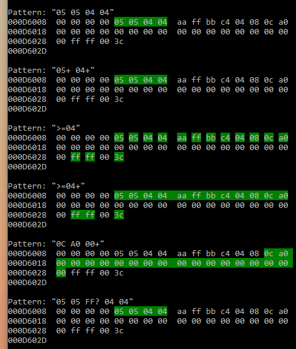

# BinFind

A C++ class for performing regex-like searches on binary data.



## Usage

Here's a basic example on how to use BinFind:

```c++
// Initialize a search in the given buffer
BinFind find(buffer, sizeof(buffer));

// Match 1 or more 0x05, 0 or 1 0xFF, and 1 or more 0x04.
auto ret = find.Find("05+ FF? 04+");

// Print out the results
for (auto result : ret) {
	printf("* %p -> %p\n", result.Pointer, result.Pointer + result.Size);
}
```

There's a simple example you can compile and run in `main.cpp` as well.

You can also call `BinFind_DumpMemory` to dump a memory region with an optional vector of sections to highlight, which will result in the screenshot above.

## License

	Copyright (c) 2017 github.com/codecat

	Permission is hereby granted, free of charge, to any person obtaining a copy
	of this software and associated documentation files (the "Software"), to deal
	in the Software without restriction, including without limitation the rights
	to use, copy, modify, merge, publish, distribute, sublicense, and/or sell
	copies of the Software, and to permit persons to whom the Software is
	furnished to do so, subject to the following conditions:

	The above copyright notice and this permission notice shall be included in all
	copies or substantial portions of the Software.

	THE SOFTWARE IS PROVIDED "AS IS", WITHOUT WARRANTY OF ANY KIND, EXPRESS OR
	IMPLIED, INCLUDING BUT NOT LIMITED TO THE WARRANTIES OF MERCHANTABILITY,
	FITNESS FOR A PARTICULAR PURPOSE AND NONINFRINGEMENT. IN NO EVENT SHALL THE
	AUTHORS OR COPYRIGHT HOLDERS BE LIABLE FOR ANY CLAIM, DAMAGES OR OTHER
	LIABILITY, WHETHER IN AN ACTION OF CONTRACT, TORT OR OTHERWISE, ARISING FROM,
	OUT OF OR IN CONNECTION WITH THE SOFTWARE OR THE USE OR OTHER DEALINGS IN THE
	SOFTWARE.
